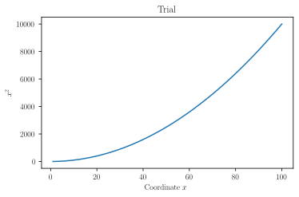
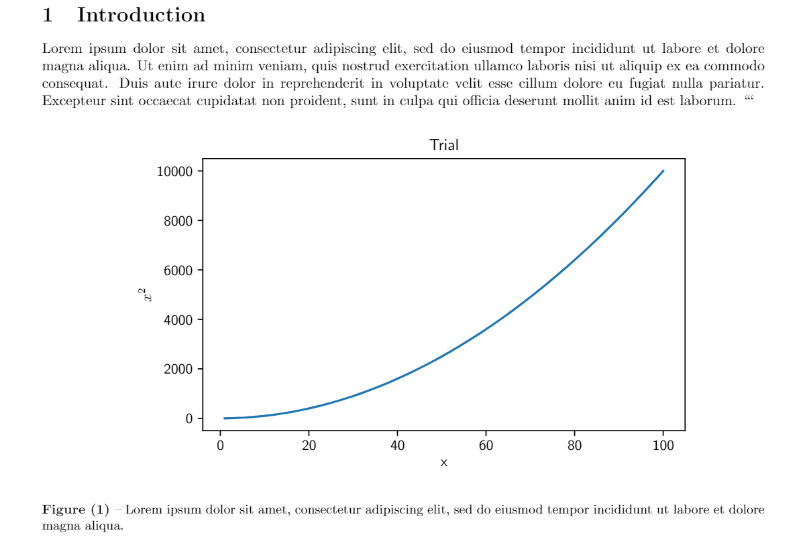

# Matplotlib2LaTeX
An high-level python library to have your plots in pgf, the perfect format for an awesome LaTeX report/publication. The documentation is available at this [link](https://mballarin97.github.io/Matplotlib2LaTeX/)

Sometimes there may be an error about the a matplotlib lockfile. Just restart the kernel.

## Installation
To install simply run 
```bash
pip install mpl2latex
```
it requires matplotlib to work.

## Example of use on jupyter notebook

First, we import numpy, matplotlib and the new library MPL2LATEX. We will then make some examples with different type of implementation


```python
import numpy as np
import matplotlib.pyplot as plt
import matplotlib
from mpl2latex import mpl2latex, latex_figsize
```

We will plot some simple data, let's say a quadratic function


```python
x = np.linspace(1, 100, 1000)
```


```python
fig, ax = plt.subplots(figsize=latex_figsize( wf=0.8) ) # width of an entire latex column
ax.plot(x, x**2)
ax.set_xlabel('Coordinate $x$')
ax.set_ylabel('$x^2$')
ax.set_title('Trial')
plt.show()
```


    

    


Now, we make the same but with the parameters of Matplotlib2LaTeX, inside the context. See the docs for a complete description of the tunable parameters


```python
flag = True
with mpl2latex(flag):
    fig, ax = plt.subplots(figsize=latex_figsize( wf=0.8) ) # width of an entire latex column
    ax.plot(x, x**2)
    ax.set_xlabel('Coordinate $x$')
    ax.set_ylabel('$x^2$')
    ax.set_title('Trial')
```

Once we exit from the context we easily come back to the matplotlib default backend and parameters!


```python
fig, ax = plt.subplots(figsize=latex_figsize( wf=0.8) ) # width of an entire latex column
ax.plot(x, x**2)
ax.set_xlabel('Coordinate $x$')
ax.set_ylabel('$x^2$')
ax.set_title('Trial')
plt.show()
```


    

    


## Using the pgf output in LaTeX
Now that we have finally reproduced the plot in pgf we show how to import it in a LaTeX document. It is really straightforward, using the `pgfplots` package. We make an example of the following here:

```latex
Lorem ipsum dolor sit amet, consectetur adipiscing elit, sed do eiusmod tempor incididunt ut labore et dolore magna aliqua. Ut enim ad minim veniam, quis nostrud exercitation ullamco laboris nisi ut aliquip ex ea commodo consequat. Duis aute irure dolor in reprehenderit in voluptate velit esse cillum dolore eu fugiat nulla pariatur. Excepteur sint occaecat cupidatat non proident, sunt in culpa qui officia deserunt mollit anim id est laborum.
\begin{figure}
    \centering
    \input{Trial.pgf}
    \caption{Lorem ipsum dolor sit amet, consectetur adipiscing elit, sed do eiusmod tempor incididunt ut labore et dolore magna aliqua.}
    \label{fig:trial}
\end{figure}
```

which gives the following output. It is a little blurred, but you can look at the original `.pdf` in the folder `Examples_files`


